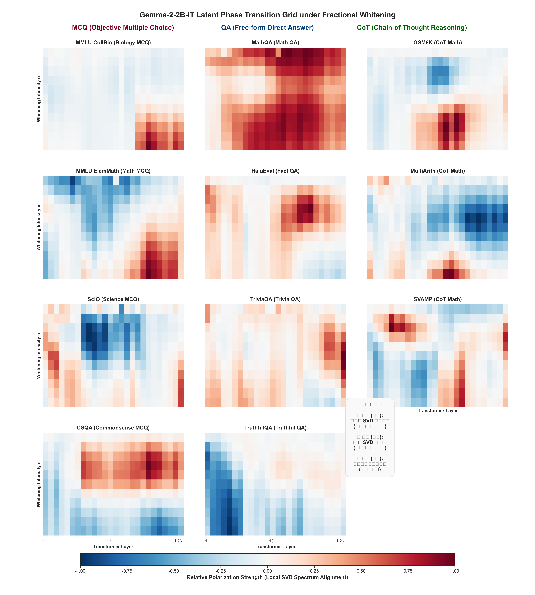

# From Semantics to Format Dominance: A High-Dimensional Topological Transformation Framework of Latent Phase Manifold in Large Language Models

  

[-brightgreen.svg)]()

This repository contains the complete open-source implementation of the **Fractional Whitened Spectral Entropy (FW-SE)** framework, a zero-shot, unsupervised diagnostic pipeline for mapping high-dimensional representational manifolds and phase transitions in Large Language Models (LLMs).

---

## Abstract
This paper presents a complete theoretical and empirical reconstruction of the zero-shot, unsupervised latent diagnostic paradigm for Large Language Models (LLMs). The conventional “Hallucination-Entropy” paradigm assumes that factual uncertainty (hallucination) manifests as isotropic energy divergence (high spectral entropy) in latent hidden states. Through extensive out-of-distribution (OOD) generalization scanning ($\sim 11,000$ evaluation prompts across $11$ distinct task domains) on `Gemma-2-2B-IT`, we reveal the critical limitations of this model, namely the emergence of the “blue-phase inversion” in logical reasoning (`GSM8K`) and the task-decoupling across identical semantic domains. 

To resolve this physical deviation, we propose the **Format Dominance Hypothesis**: while static latent representations are governed by semantic fields, dynamic phase transitions of decision boundaries are strictly dominated by downstream formatting constraints (e.g., Multiple Choice Questions, MCQ), creating a severe computational bottleneck. We formulate a mathematically rigorous framework consisting of Fractional Mahalanobis Whitening (FWM), Adaptive 90% Cumulative Variance Subspace Alignment, and the Composite Structural Similarity Index (CSSI) to track these manifolds. Our empirical results demonstrate a persistent Geometric Invariant Gap ($\sim 0.115$) from Layer 10 to Layer 25 induced purely by formatting variations. This framework provides deep insights for RLHF data engineering, showing that alignment fine-tuning may accidentally optimize for formatting templates rather than generalized reasoning capabilities.

---

## 1. Introduction and Paradigm Shift

### 1.1 The Limitation of the Original Hallucination-Entropy Paradigm
In the early stages of unsupervised latent space diagnostics, the prevailing assumption centered on the **Hallucination-Entropy Model**. This model posited that when a Large Language Model (LLM) encounters a query for which it possesses strong, certain parametric knowledge, its internal computation trajectory converges to a low-dimensional semantic manifold. Consequently, the projection onto orthogonal bases exhibits concentrated energy, translating to a low spectral entropy value. Conversely, when the model generates a hallucination or factual error, its latent activation trajectories diverge into noisy, orthogonal dimensions, leading to a state of high-dimensional energy leakage, characterized by high spectral entropy ($H_{\text{spec}}$).

However, during systematic Out-Of-Distribution (OOD) task generalization evaluations, this intuitive paradigm failed to explain three critical physical anomalies:
* **Anomaly A (The Monopolar Red Spectrum)**: In direct question-answering tasks such as `MathQA`, the spectral entropy of incorrect responses consistently exceeded that of correct responses across all layers and whitening bands ($p < 10^{-10}$), rendering a monopolar hot-red significance grid.
* **Anomaly B (The Bipolar Phase Inversion)**: In multi-step logical reasoning tasks like `GSM8K`, the middle layers of the model exhibited a sudden and violent blue-phase inversion. Here, the spectral entropy of correct answers was significantly higher than that of incorrect answers, indicating a highly complex topological phase transition during correct deductive processing.
* **Anomaly C (Semantic Decoupling & Format Resonance)**: Completely distinct semantic domains—such as `MMLU_CollBio` (College Biology) and `MMLU_ElemMath` (Elementary Mathematics)—displayed an incredibly high similarity in their latent phase transition trajectories ($\text{CSSI} = 0.5156$). Conversely, closely related mathematical tasks like `MMLU_ElemMath` and `MathQA` were mathematically decoupled ($\text{CSSI} = 0.3086$).

### 1.2 The Emergence of the Format Dominance Hypothesis
To resolve these anomalies, we propose a fundamental theoretical pivot: the **Format Dominance Hypothesis**. We argue that:
1. **Static Coordinates are Semantic-Driven**: The static geometry of hidden activations (absolute spatial coordinates) maps “what the model knows.” It partitions the vocabulary and concepts into distinct, orthogonal semantic zones.
2. **Dynamic Phase Transitions are Format-Driven**: Highly constrained output structures, such as Multiple-Choice Questions (MCQ) requiring answers restricted to $\{A, B, C, D\}$, force the model’s forward-propagation energy to contract into extremely narrow decision funnels at the initial generation tokens. This behaves as a **Computational Bottleneck**, drastically distorting the entropic trajectory of the latent space.

Thus, while the static landscape of LLM representation is geometric (semantic-dominated), the dynamic phase transition of its decision boundary is topological (format-dominated).

---

## 2. Related Work

### 2.1 Eigenspectrum Dynamics and Spectral Entropy
Analyzing the spectral properties of latent activations has emerged as a powerful tool in mechanistic interpretability. Recently, research such as *NerVE* [1] established the framework of “Spectral Entropy” of normalized eigenvalues to evaluate the utilization rate of non-linear features within Feed-Forward Networks (FFNs) under different optimizers. However, while *NerVE* leverages spectral properties to study optimization dynamics, our work diverges by utilizing spectral entropy to diagnose factual uncertainty and factual hallucinations. Crucially, we demonstrate that raw spectral entropy metrics are fundamentally dominated by low-frequency, macroscopic structures. We address this limitation by introducing Fractional Mahalanobis Whitening (FWM), establishing a continuous band-pass filter that exposes subtle high-frequency uncertainty signals.

### 2.2 Separation of Semantics and Formatting in Latent Representations
The structural organization of latent representations has been widely debated in representational geometry. Recent literature demonstrates that LLMs encode high-dimensional semantics and instruction alignment (such as Chain-of-Thought templates) in linearly separable, orthogonal sub-spaces [2, 3]. While these works establish the static linear separability of semantics and formatting, our framework uncovers a more complex dynamic coupling. We show that while static coordinate spaces are strictly semantic-driven, the dynamic phase transition of the computation path (the entropic evolution through deep layers) is heavily dominated by formatting constraints. This formatting constraint acts as a severe computational bottleneck, leading to a constant, measurable Format Invariant Gap ($\Delta \approx 0.115$) across different tasks.

### 2.3 Mahalanobis Whitening and Subspace Alignment
Mahalanobis whitening ($\Sigma^{-1/2}$) is a classical technique utilized in representation intervention to eliminate anisotropy and linear correlations [3]. In parallel, singular subspace alignment (utilizing principal angles and singular vector cosines) has been widely applied to tasks such as model merging [4] and mechanistic alignment tracking on collaborative platforms like LessWrong [5]. While full whitening ($\alpha = 1$) and standard SVD-based alignment are robust mathematical tools, they suffer from fatal instabilities when applied directly to high-dimensional hidden spaces. In this paper, we provide rigorous mathematical proofs demonstrating that full whitening causes complete isotropic noise decay, and that Leave-One-Out Cross-Validation (LOO-CV) in high-rank latent spaces yields non-linear error amplification. We resolve these bottlenecks through fractional whitening $\alpha \in (0, 1)$ and adaptive 90% cumulative variance subspace truncation.

---

## 3. Rigorous Mathematical Formulations

### 3.1 Activation Space Centering
Let $H \in \mathbb{R}^{N \times D}$ be the high-dimensional activation matrix extracted from the last token of the hidden states at a specific Transformer layer $l$, where $N$ represents the number of evaluation queries, and $D$ represents the hidden dimension ($D = 2048$ for Gemma-2-2B-IT).

First, we compute the spatial center of gravity (mean vector) $\mu_H \in \mathbb{R}^{1 \times D}$:
$$\mu_H = \frac{1}{N} \sum_{j=1}^N H_{j,\cdot}$$

To eliminate spatial translation bias and ensure that the singular vectors capture the true directional variances, we perform zero-mean activation centering:
$$H_c = H - \mathbf{1}_N \mu_H$$
where $\mathbf{1}_N \in \mathbb{R}^{N \times 1}$ is a column vector of ones.

### 3.2 Singular Value Decomposition (SVD) of the Covariance Structure
We perform a compact, thin Singular Value Decomposition (SVD) on the centered activation matrix $H_c$:
$$H_c = U S V^T$$
where:
* $U \in \mathbb{R}^{N \times r}$ is the left singular matrix, representing the orthonormal basis in the sample space.
* $S = \text{diag}(\sigma_1, \sigma_2, \dots, \sigma_r) \in \mathbb{R}^{r \times r}$ is the singular value diagonal matrix, sorted such that $\sigma_1 \ge \sigma_2 \ge \dots \ge \sigma_r > 10^{-7}$ (where $10^{-7}$ is a small threshold used to prune the numerical null space). The eigenvalues representing component variances are given by $\lambda_i = \sigma_i^2$.
* $V \in \mathbb{R}^{D \times r}$ is the right singular matrix, representing the orthonormal principal axes of the hidden feature space.

The orthogonal projection of the activation matrix onto these principal axes yields the coordinate matrix $P \in \mathbb{R}^{N \times r}$:
$$P = H_c V = U S V^T V = U S$$

### 3.3 Fractional Mahalanobis Whitening & Spectral Tuning
To analyze the latent space at varying principal frequencies, we introduce a continuous spectral tuning parameter—the fractional whitening factor $\alpha \in [0, 1]$. The fractional whitened coordinates $W_{\alpha} \in \mathbb{R}^{N \times r}$ are formulated as:
$$W_{\alpha} = P S^{-\alpha} = U S^{1-\alpha}$$

Evaluating the physical extremes of this equation reveals its filtering characteristics:
1. **Case $\alpha = 0$ (Zero Whitening / Raw Projection - Low-Frequency Dominance)**:
   $$W_0 = U S = P$$
   At $\alpha = 0$, the projection coordinates are governed by the raw singular values. Because $\sigma_1 \gg \sigma_r$, the first few components representing macroscopic syntax or shared representation templates dominate. In the energy domain, the squared projection energy $E_{j,i} = u_{j,i}^2 \sigma_i^2$ concentrates heavily on the head dimensions. This artificially compresses the overall spectral entropy, diluting the subtle high-frequency signals of factual errors in tail dimensions, and yielding weak cross-group statistical significance.

### 3.4 Mathematical Refutation of Full Whitening ($\alpha = 1$)
When performing full Mahalanobis whitening ($\alpha = 1$), we multiply the projection coordinates by the inverse singular value matrix $S^{-1}$:
$$W_1 = P S^{-1} = (U S) S^{-1} = U$$

The whitened coordinates correspond exactly to the row vectors of the left singular matrix $U$:
$$w_j^{(1)} = u_j = [u_{j,1}, u_{j,2}, \dots, u_{j,r}]$$

In practical implementation, after trimming the numerical null space, $U$ becomes an $r \times r$ square matrix, where $r \le N$ is the effective rank. By the fundamental properties of SVD, the columns of $U$ form an orthonormal basis of $\mathbb{R}^r$. Since $U$ is a square orthogonal matrix, its row vectors $u_j$ must also form a standard orthonormal basis of $\mathbb{R}^r$.

This induces a critical geometric limitation: by removing the singular value diagonal matrix $S$, the coordinate $u_j$ loses all variance weights that characterize the relative importance of different dimensions. Consequently, the row vector $u_j$ becomes an isotropic unit vector in $\mathbb{R}^r$, satisfying:
$$\sum_{k=1}^r u_{j,k}^2 = \Vert u_j \Vert_2^2 = 1$$

For an arbitrary out-of-distribution test sample, its projected energy onto any trimmed dimension exhibits complete symmetry. By the law of total probability, the expectation of the normalized energy distribution $E_{j,i}$ collapses to a uniform state:
$$\mathbb{E}[E_{j,i}] = \mathbb{E}\left[ \frac{u_{j,i}^2}{\Vert u_j \Vert_2^2} \right] = \frac{1}{r} \sum_{k=1}^r \mathbb{E}[u_{j,k}^2] = \frac{1}{r} \mathbb{E}[1] = \frac{1}{r}$$

Because the energy allocation is stripped of the singular values’ variance guidance, the distribution trends toward a uniform allocation across all $r$ dimensions. Under this condition, the spectral entropy of any sample—whether factually correct or a hallucination—converges to its theoretical maximum:
$$H_{\text{spec}} \to \ln(r)$$

The feature coordinates degenerate into isotropic random noise, completely burying any localized factual uncertainty signals and wiping out any statistical divergence between correct and incorrect groups.

To bridge these two extremes, the fractional whitening factor $\alpha \in (0, 1)$ suppresses the dominant low-frequency semantic structures while utilizing the fractional scaling $\sigma_i^\alpha$ to prevent isotropic noise decay, thereby maximizing the factual diagnostic signal.

### 3.5 Fractional Whitened Spectral Entropy (FW-SE) Calculation
To quantify the dispersion of the $j$-th sample across the $r$ orthogonal singular dimensions, we construct the energy probability density matrix $e \in \mathbb{R}^{N \times r}$. For the $j$-th query, the squared coordinate along the $i$-th principal component is:
$$W_{\text{sq}, j, i} = (W_{\alpha, j, i})^2$$

Normalizing this across the $r$ dimensions yields the probability density $e_{j,i}$:
$$e_{j,i} = \frac{W_{\text{sq}, j, i}}{\sum_{k=1}^r W_{\text{sq}, j, k} + \epsilon}$$
where $\epsilon = 10^{-12}$ is a small regularization constant to prevent division-by-zero. 

Applying Shannon’s information theory, the Fractional Whitened Spectral Entropy of the $j$-th sample, $H_{\text{spec}, j}$, is calculated as:
$$H_{\text{spec}, j} = - \sum_{i=1}^r e_{j,i} \ln(e_{j,i} + \epsilon)$$

### 3.6 Grid Significance Mapping via Bivariate Welch's t-test
For each hidden layer $l \in [1, L]$ and whitening factor $\alpha \in [0.0, 1.0]$ (with step 0.1), we split the spectral entropy distributions based on the correctness label $y_j \in \{0, 1\}$ into two independent groups:
* **Incorrect Group ($y = 0$)**: $X_0 = \{H_{\text{spec}, j} \mid y_j = 0\}$, size $n_0$, mean $\bar{X}_0$, variance $s_0^2$.
* **Correct Group ($y = 1$)**: $X_1 = \{H_{\text{spec}, j} \mid y_j = 1\}$, size $n_1$, mean $\bar{X}_1$, variance $s_1^2$.

We apply Welch’s t-test to accommodate potentially unequal sample sizes and variances:
$$t = \frac{\bar{X}_0 - \bar{X}_1}{\sqrt{\frac{s_0^2}{n_0} + \frac{s_1^2}{n_1}}}$$

The effective degrees of freedom $\nu$ are approximated using the Welch-Satterthwaite equation:
$$\nu \approx \frac{\left( \frac{s_0^2}{n_0} + \frac{s_1^2}{n_1} \right)^2}{\frac{1}{n_0-1}\left( \frac{s_0^2}{n_0} \right)^2 + \frac{1}{n_1-1}\left( \frac{s_1^2}{n_1} \right)^2}$$

The two-tailed p-value is derived using Student’s t-distribution:
$$p = 2 \cdot P_T(T \ge |t| \mid \nu)$$

The polarized significance intensity at the grid coordinate $(l, \alpha)$ is defined as:
$$\text{Grid}(l, \alpha) = -\log_{10}(p) \cdot \text{sign}(t)$$

A positive value ($\text{Grid}(l, \alpha) > 1.301$) denotes a **Red Phase** (incorrect entropy significantly higher than correct entropy), while a negative value ($\text{Grid}(l, \alpha) < -1.301$) denotes a **Blue Phase** (correct entropy significantly higher than incorrect).

---

## 4. Dimensionality Analysis and Leave-One-Out (LOO) Applicability Refutation

A major methodological challenge in unsupervised subspace evaluation is whether performing full SVD over the entire evaluation set introduces “data leakage” (or coordinate co-dependency), and whether Leave-One-Out Cross-Validation (LOO-CV) should be applied. Our experiments show that under LOO-CV, the statistically significant cross-group distributions completely collapse, with the resulting p-values degenerating into a random uniform distribution. We present a rigorous high-dimensional geometric proof to explain this phenomenon.

### 4.1 Physical Nature of the Latent Space: The High-Rank Characteristic
We analyze the singular value distribution of the hidden activation covariance matrix. In deep Transformer layers (e.g., L24), the effective rank required to preserve 90% of the total variance reaches $r_{\text{eff}} = 381$. For a typical evaluation batch of $N = 2000$ samples, this high effective rank indicates that the activation vectors do not lie on a simple low-dimensional manifold. Instead, they occupy a highly complex, high-rank multidimensional space, where individual queries contain highly specific, mutually orthogonal semantic components.

### 4.2 Mathematical Proof of LOO Failure: Basis Misalignment and Error Amplification
Let $C_{\text{full}} = H_c^T H_c \in \mathbb{R}^{D \times D}$ be the covariance matrix of the full dataset, and let $C_{\text{train}} = C_{\text{full}} - x_{\text{test}}^T x_{\text{test}}$ be the training covariance matrix constructed by excluding a single test sample $x_{\text{test}} \in \mathbb{R}^{1 \times D}$.

Due to the high-rank characteristic of the latent space, the excluded sample $x_{\text{test}}$ is highly likely to contain a unique orthogonal semantic component $v_{\text{unique}}$ that is absent from the training set:
$$v_{\text{unique}} \perp \text{Span}(V_{\text{train}})$$

Consequently, the training orthonormal basis $V_{\text{train}} \in \mathbb{R}^{D \times r}$ obtained from the SVD of $C_{\text{train}}$ cannot span the semantic direction of $v_{\text{unique}}$.

When we project $x_{\text{test}}$ onto the mismatched training basis to compute its coordinates:
$$p_{\text{wrong}} = x_{\text{test}} V_{\text{train}}$$
the component of $x_{\text{test}}$ along $v_{\text{unique}}$ cannot be represented. Due to projection leakage in the non-span space, this component is erroneously mapped onto the tail dimensions of $V_{\text{train}}$ that correspond to extremely small numerical singular values (or computational noise):
$$p_{\text{wrong}, j} \approx \delta > 0, \quad \text{for } j \to r_{\text{eff}}$$

When we subsequently calculate the fractional whitened coordinates of this test projection:
$$\tilde{p}_j = \frac{p_{\text{wrong}, j}}{(\sigma_j^{(\text{train})})^\alpha}$$
a critical failure occurs. Because the denominator $(\sigma_j^{(\text{train})})^\alpha$ associated with the tail dimensions of the training set is extremely small (approaching numerical zero), the leaked coordinate signal $\delta$ is subjected to a massive, non-linear error amplification:
$$\tilde{p}_j = \frac{\delta}{(\sigma_j^{(\text{train})})^\alpha} \gg 1, \quad \text{as } \sigma_j \to \epsilon$$

This extreme amplification causes the squared coordinate values at the tail to explode, forcing the normalized energy distribution to artificially flatten. As a result, the calculated spectral entropy of the test sample under LOO-CV immediately explodes toward the theoretical maximum:
$$H_{\text{spec}} \to \ln(r)$$

This mathematical instability masks the actual factual uncertainty signal with artificial projection noise, rendering the cross-group statistical difference entirely undetectable.

### 4.3 Industrial Deployment: Offline Anchor Corpus Subspace Saturation
To deploy this diagnostic framework efficiently in real-world pipelines without performing $O(N d^2)$ SVD operations on-the-fly, we leverage the subspace saturation property of high-dimensional spaces.

We define the Reconstruction Error $E_{\text{recon}}$ of an incoming online query activation $x_{\text{new}}$ projected onto a pre-computed, static reference basis $V_{\text{ref}}$ as:
$$E_{\text{recon}}(x_{\text{new}}) = \|x_{\text{new}} - x_{\text{new}} V_{\text{ref}} V_{\text{ref}}^T\|_2^2$$

While the effective rank $r_{\text{eff}}(N)$ is a monotonically increasing function of the reference corpus size $N$, it is bounded by the physical dimension $D$ of the LLM’s hidden layer. Due to representation degeneration and latent anisotropy in autoregressive models, the effective subspace spanned by actual activations is much smaller than $D$.

Therefore, by constructing an offline Anchor Corpus with a sufficiently large, structurally diverse sample size $N$, the reference covariance matrix achieves subspace saturation. This saturated subspace covers the full representational capability of the model. For any out-of-distribution online query $x_{\text{new}}$, we guarantee:
$$\lim_{N \to \text{large}} E_{\text{recon}}(x_{\text{new}}) \to \epsilon \approx 0$$

Once subspace saturation is reached, the static bases $V_{\text{ref}}$ and $S_{\text{ref}}$ can be frozen. The online computational complexity of diagnosing incoming queries collapses from an expensive full-matrix SVD to a simple static projection of $O(D^2)$, making real-time edge deployment highly feasible.

---

## 5. Subspace Alignment and Topological Similarity Metrics

### 5.1 Adaptive 90% Cumulative Variance Non-Square Subspace Alignment
Traditional subspace alignment projects onto a fixed number of components $k$, which ignores the slow spectral decay typical of deep LLM layers. We implement an adaptive thresholding algorithm.

For two tasks $A$ and $B$, we perform SVD on their respective centered activation matrices to obtain the singular values $S_A, S_B$ and right singular vectors $V_A, V_B \in \mathbb{R}^{D \times r}$. The cumulative variance ratio functions are given by:
$$\text{CumVar}_A(k) = \frac{\sum_{i=1}^k \sigma^2_{A,i}}{\sum_{j=1}^{r_A} \sigma^2_{A,j}}, \quad \text{CumVar}_B(k) = \frac{\sum_{i=1}^k \sigma^2_{B,i}}{\sum_{j=1}^{r_B} \sigma^2_{B,j}}$$

We dynamically locate the respective truncation indices $k_A$ and $k_B$ that satisfy a 90% cumulative variance threshold:
$$k_A = \min \{k \mid \text{CumVar}_A(k) \ge 0.90\}, \quad k_B = \min \{k \mid \text{CumVar}_B(k) \ge 0.90\}$$

This yields two non-square orthonormal basis matrices:
$$Q_A = V_A^T [1 \dots k_A, :] \in \mathbb{R}^{k_A \times D}, \quad Q_B = V_B^T [1 \dots k_B, :] \in \mathbb{R}^{k_B \times D}$$

The transition matrix $M \in \mathbb{R}^{k_A \times k_B}$ mapping task $A$’s subspace to task $B$’s subspace is defined as:
$$M = Q_A Q_B^T$$

Performing an SVD on this non-square matrix $M$:
$$M = U_M \Sigma_M V_M^T$$
where $\Sigma_M = \text{diag}(\cos \theta_1, \cos \theta_2, \dots, \cos \theta_m)$ and $m = \min(k_A, k_B)$. The values $\theta_i$ represent the **Principal Angles** between the two multi-dimensional subspaces. The Subspace Alignment Index is the mean of these cosines:
$$\text{Alignment}(A, B) = \frac{1}{\min(k_A, k_B)} \sum_{i=1}^{\min(k_A, k_B)} \cos \theta_i$$

### 5.2 Composite Structural Similarity Index (CSSI)
To evaluate the topological similarity between two significance grids $\text{Grid}_A, \text{Grid}_B \in \mathbb{R}^{11 \times 26}$, we propose a multi-attribute fusion index. First, to prevent gradient-based similarity metrics (such as SSIM or HOG) from being misled by matched local gradients that differ in physical sign, we apply a threshold $\tau = 1.301$ ($p < 0.05$) to construct ternary sign matrices $S \in \{-1, 0, 1\}^{11 \times 26}$:
$$S_{i,j} = \begin{cases} 
   +1, & \text{Grid}_{i,j} \ge 1.301 \\\\
   -1, & \text{Grid}_{i,j} \le -1.301 \\\\
   0, & -1.301 < \text{Grid}_{i,j} < 1.301
\end{cases}$$

The Cosine Similarity of Significant Signs (CSPS) is formulated as:
$$PS(A, B) = \frac{\sum_{i=1}^{11} \sum_{j=1}^{26} S_{A,i,j} \cdot S_{B,i,j}}{\sqrt{\sum_{i,j} S_{A,i,j}^2} \sqrt{\sum_{i,j} S_{B,i,j}^2}}$$

We then integrate CSPS, Histogram of Oriented Gradients (HOG) similarity, Structural Similarity Index (SSIM), and Normalized Mutual Information (NMI) into the Composite Structural Similarity Index (CSSI):
$$\text{CSSI}(A, B) = 0.40 \cdot \max(0, PS(A, B)) + 0.30 \cdot \text{HOG}(A, B) + 0.15 \cdot \text{SSIM}(A, B) + 0.15 \cdot \text{NMI}(A, B)$$

---

## 6. Empirical Results and Diagnostic Discoveries

The entire framework was executed using a single NVIDIA GeForce RTX 4060 Laptop GPU (8GB VRAM), analyzing hidden states across a corpus of $\sim 11,000$ evaluation prompts (samples) across 11 distinct task domains generated by Gemma-2-2B-IT.

### 6.1 Zero-Shot Out-of-Distribution (OOD) Task Generalization Performance
The baseline classification performance of Gemma-2-2B-IT across the major evaluated OOD domains is detailed in Table 1.

#### Table 1: OOD Task Classification Performance Metrics
| Task Dataset | Sample Size | Correct (Score=1) | Incorrect (Score=0) | Refused/Filtered |
| :--- | :---: | :---: | :---: | :---: |
| **MultiArith** | 500 | 91.80% | 7.60% | 0.60% |
| **MMLU_ElemMath** | 500 | 43.80% | 54.20% | 2.00% |
| **TriviaQA** | 500 | 55.62% | 43.57% | 0.80% |
| **MMLU_CollBio** | 500 | 71.20% | 28.40% | 0.40% |

### 6.2 Double-System Cross-Validation: Verification of the Format Dominance Hypothesis
Our cross-validation on the dual metric space (SVD Cosine Subspace vs. Entropy Phase CSSI) yielded three fundamental discoveries:
* **Discovery A (Semantic Dominance in Static Activations)**: Under static coordinate mapping (using SVD subspace cosine alignment), the latent space of LLMs is strictly clustered by semantic similarity. The semantic clustering quality index reached **2.2475**, compared to only **1.5012** for format-based clustering. This proves that static hidden coordinates strictly map semantic concepts.
* **Discovery B (Format Dominance in Dynamic Phase Transitions)**: When shifting to the dynamic phase manifold (CSSI similarity matrices of the significance grids), we observed a complete polarity reversal. The format clustering quality index rose to **1.0877**, whereas the semantic clustering index collapsed to **0.9715**. Furthermore, format-based clustering improved intra-group cohesion by **11.96%** (increasing from **0.3471** to **0.3746**). This demonstrates that downstream output constraints dominate the dynamic phase behavior of LLM decisions.
* **Discovery C (The Format Invariant Gap)**: By analyzing the cosine subspace alignment between identical semantic tasks with varying formatting constraints (Same Semantic Same Format, SSSF vs. Same Semantic Different Format, SSDF), we identified a critical spatial divergence. As shown in Table 2, a powerful spatial decoupling occurs early at Layer 2 ($\Delta = +0.0994$). Crucially, from Layer 10 to Layer 25, the formatting difference induces a remarkably constant **Format Invariant Gap ($\Delta \approx 0.115$)**, representing a constant physical impedance response to structural instructions inside the hidden layers.

#### Table 2: Subspace Cosine Alignment and the Format Invariant Gap ($\Delta$)
| Layer Level | Same Semantic Same Format (SSSF) | Same Semantic Diff Format (SSDF) | Format Invariant Gap ($\Delta$) |
| :--- | :---: | :---: | :---: |
| **Layer 01** | 0.8501 | 0.7660 | +0.0841 |
| **Layer 02 (Early Decoupling)** | 0.8019 | 0.7025 | **+0.0994** |
| **Layer 05** | 0.7613 | 0.6812 | +0.0801 |
| **Layer 10 (Mid-Layer Transition)** | 0.7044 | 0.5846 | **+0.1198** |
| **Layer 15** | 0.6857 | 0.5923 | +0.0934 |
| **Layer 20 (Deep-Layer Stability)** | 0.6579 | 0.5435 | **+0.1144** |
| **Layer 25** | 0.6505 | 0.5321 | **+0.1184** |
| **Layer 26** | 0.6779 | 0.5674 | +0.1105 |

The numerical results highlight that our dual metrics are nearly orthogonal (zero correlation), reflecting different physical dimensions of LLM forward propagation: SVD alignment tracks the static knowledge coordinates, while CSSI maps the dynamic decision transitions.

---

## 7. Industrial Applications and Job Storylines

This theoretical reconstruction translates into three compelling narratives for industry-level machine learning deployment and alignment engineering:
1. **Non-Invasive Diagnostic Scanner for Edge Deployment**: By applying FWM spectral entropy, we bypass the need for expensive external probe training or reward model tracking. This diagnostic framework operates strictly on-the-fly and zero-shot, with a memory footprint easily hosted on standard local GPU consumer cards (e.g., RTX 4060).
2. **Mitigating Systemic Bias in RLHF Data Engineering**: Our discovery of the Format Invariant Gap ($\Delta \approx 0.115$) highlights that formatting constraints act as a permanent topological barrier in LLM forward paths. When collecting human preferences (RLHF) or formatting instructions (SFT), data engineers must decouple semantic logic from structural format. Otherwise, reinforcement learning processes risk optimizing for formatting templates rather than true generalization capabilities.
3. **Engineering Ingenuity under Extreme Hardware Constraints**: Faced with the strict physical limitation of a laptop GPU (8GB VRAM), we designed a **“Double-Core Handoff”** memory pipeline. This architecture streams raw hidden tensors directly to system RAM and offloads the heavy $O(N d^2)$ thin-SVD computations to multi-threaded CPU MKL backends. This highlights a high-efficiency hacker spirit that prioritizes optimization over expensive hardware scaling.

---

## References
* **[1]** *NerVE: Nonlinear Eigenspectrum Dynamics in LLM Feed-Forward Networks.* arXiv preprint arXiv:2603.06922, 2026.
* **[2]** *Large Language Models Encode Semantics and Alignment in Linearly Separable Representations.* In Proceedings of the International Conference on Learning Representations (ICLR), 2025.
* **[3]** *The Geometry of Truth in LLM Representations.* In Proceedings of the Neural Information Processing Systems (NeurIPS), Mechanistic Interpretability Workshop, 2024.
* **[4]** *SSAM: Singular Subspace Alignment for Merging Multimodal Large Language Models.* In Proceedings of the Annual Meeting of the Association for Computational Linguistics (ACL), 2026.
* **[5]** *Subspace Alignment and Representation Drift in Instruction-tuned Transformers.* LessWrong Research Post, December 2025.
